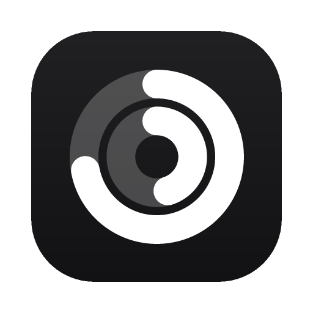
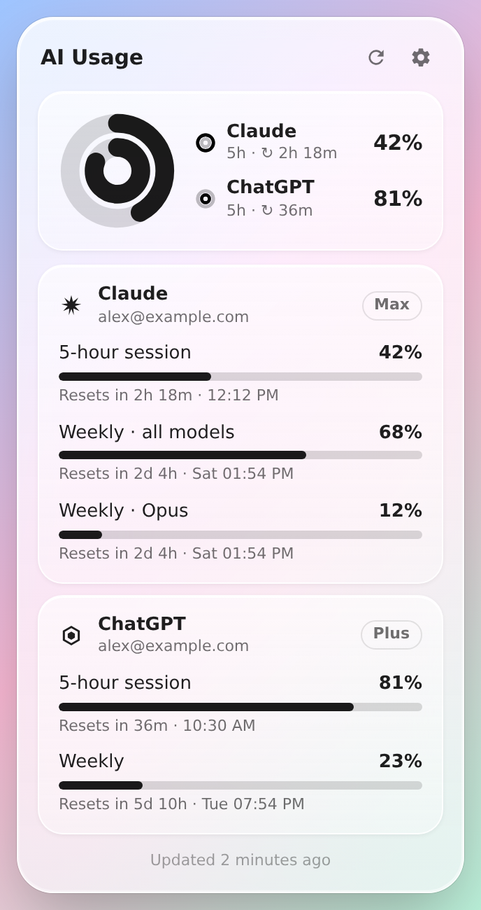
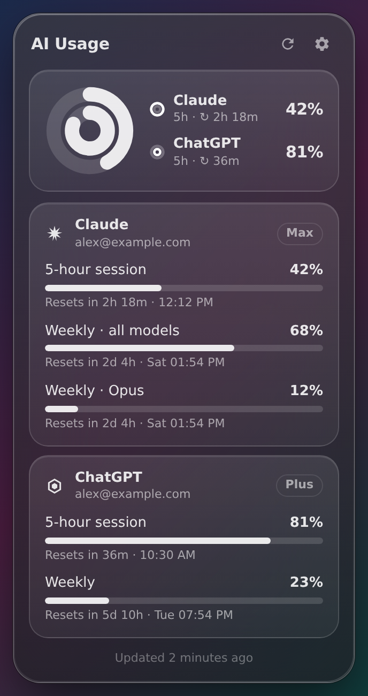
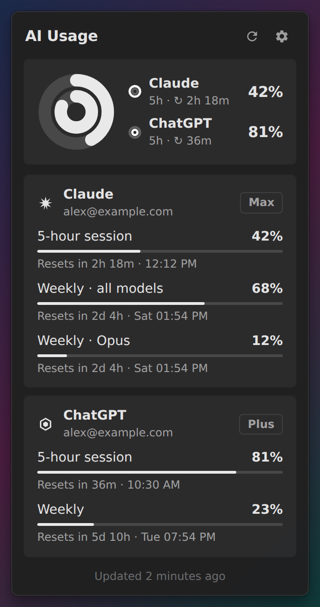
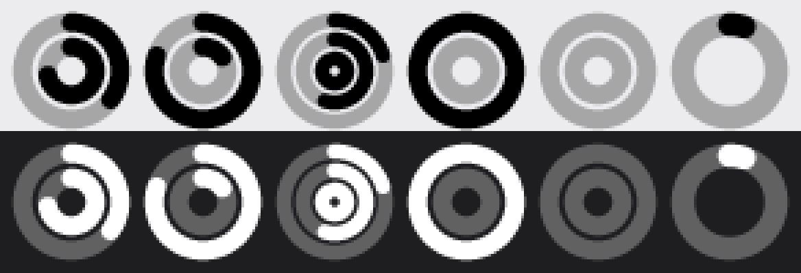

<div align="center">



# AIUsageBar

**Лимиты ChatGPT и Claude в виде колец активности в строке меню и трее**

[](https://github.com/alxrepin/aiusagebar/actions/workflows/release.yml)
[](https://github.com/alxrepin/aiusagebar/releases/latest)
[](LICENSE)


[**Скачать**](https://github.com/alxrepin/aiusagebar/releases/latest) · [Как это работает](#как-это-работает) · [Приватность](#приватность) · [Разработка](#разработка)

[English](README.md) · **Русский**

</div>

<br />

<p align="center">
  
  &nbsp;
  
  &nbsp;
  
</p>

Иконка в трее показывает, сколько лимита уже потрачено: чем больше заполнено кольцо, тем меньше осталось. Если кликнуть по иконке, откроется окно с каждым лимитом, процентами и временем до сброса.

<p align="center">
  
</p>

## Возможности

- **Кольца как в Apple Fitness.** Иконка монохромная, в ней от 1 до 3 концентрических колец. На macOS она перекрашивается вместе со строкой меню, на Windows подстраивается под тему панели задач.
- **Раскладка колец выбирается сама:**
  - подключён один провайдер: сессионный (5-часовой) и недельный лимит;
  - подключено несколько: сессионный лимит каждого.
- **Ручная настройка.** В любое кольцо можно поставить любую метрику любого аккаунта, например «Claude · Weekly · Opus».
- **Подробности по клику:** проценты, прогресс-бары, «сброс через 2 ч 18 мин · 12:10», тариф (Plus, Pro, Max…).
- **Уведомление о заканчивающемся лимите.** Когда остаётся меньше заданного порога (по умолчанию 15%), приходит системное уведомление. На каждый лимит — одно уведомление; после сброса оно снова «взводится». Порог и сами уведомления настраиваются.
- **Фоновое обновление** раз в 1–30 минут. При открытии окна свежие данные подтягиваются сразу. Если API ответил ошибкой или «слишком много запросов», следующие попытки идут всё реже.
- **Несколько провайдеров и аккаунтов**, в том числе несколько аккаунтов одного провайдера (например, рабочий и личный Claude). Добавляются и удаляются в два клика.
- **Сам восстанавливает подключение.** Истёкшие токены обновляются автоматически (при 401 и 403). Если вход действительно слетел, в карточке появляется «Войти заново» и приходит одно уведомление. После сна или смены сети данные обновляются сразу.
- **Запускается вместе с компьютером** (можно выключить в настройках).
- **Автообновление.** Приложение раз в несколько часов проверяет GitHub Releases, показывает кнопку «Обновить» и перезапускается в новую версию.
- **Выглядит как родное приложение:** Liquid Glass на macOS, Fluent на Windows 11, светлая и тёмная темы.
- **Лёгкое приложение.** Сделано на [Electrobun](https://electrobun.dev) и системном WebView, без встроенного Chromium.
- Интерфейс на русском и английском.

## Установка

**Проще всего** одной командой. Она скачает последний релиз и установит его без предупреждений Gatekeeper и SmartScreen:

```sh
# macOS (Apple Silicon)
curl -fsSL https://raw.githubusercontent.com/alxrepin/aiusagebar/main/scripts/install.sh | bash
```

```powershell
# Windows 10 / 11 (PowerShell)
irm https://raw.githubusercontent.com/alxrepin/aiusagebar/main/scripts/install.ps1 | iex
```

Или скачайте файл для своей системы со [страницы релизов](https://github.com/alxrepin/aiusagebar/releases/latest):

| Система | Файл |
| --- | --- |
| macOS (Apple Silicon) | `AIUsageBar-<версия>-macos-arm64.dmg` |
| Windows 10 / 11 (x64) | `AIUsageBar-<версия>-windows-x64-Setup.zip` |

После установки AIUsageBar **обновляется сам**: когда выходит новая версия, в окне появляется кнопка **«Обновить»**.

<details>
<summary><b>macOS: «приложение повреждено» или «не удаётся проверить разработчика»</b></summary>

Релизы подписаны ad-hoc, но не нотаризованы Apple. После переноса в «Программы» выполните один раз:

```sh
xattr -dr com.apple.quarantine /Applications/AIUsageBar.app
```

Можно и так: правый клик по приложению → «Открыть» → «Открыть».
</details>

<details>
<summary><b>Windows: SmartScreen предупреждает о неизвестном издателе</b></summary>

Нажмите «Подробнее» → «Выполнить в любом случае». Сборка не подписана сертификатом издателя.
</details>

<details>
<summary><b>Откуда предупреждения и почему скрипт установки их не вызывает?</b></summary>

macOS и Windows помечают файлы, скачанные **браузером** (атрибут quarantine или «Mark of the Web»), и проверяют у них нотаризацию Apple или сертификат подписи. У бесплатного AIUsageBar нет ни того, ни другого: Apple Developer ID стоит $99 в год, сертификат для Windows сопоставимо. Файлы, скачанные через `curl` или PowerShell, не помечаются, поэтому скрипт установки и встроенный апдейтер обходятся без предупреждений. Разобраться с ними придётся один раз и только при установке из браузера.
</details>

## Как это работает

При первом запуске откройте окно и подключите провайдера. Для каждого есть два способа.

| | Вход через браузер | Готовый логин CLI |
| --- | --- | --- |
| **Claude** | «Sign in with Claude»: откроется claude.ai | «Use Claude Code login»: берётся вход `claude` CLI |
| **ChatGPT** | «Sign in with ChatGPT»: откроется chatgpt.com | «Use Codex CLI login»: берётся `~/.codex/auth.json` |

**Вход через браузер** использует OAuth 2.0 с PKCE. Приложение ненадолго слушает `localhost`, браузер возвращает туда код авторизации, и приложение само обменивает его на токены. Токены потом обновляются автоматически. Сервер-посредник не нужен.

**Готовый логин CLI** только читается: токены Claude Code или Codex не меняются, и CLI продолжает работать как раньше.

**Несколько аккаунтов одного провайдера.** Нажмите **+** у провайдера в настройках ещё раз. ChatGPT на странице входа спросит, какой аккаунт использовать. Для Claude сначала выйдите на claude.ai или выберите там другой аккаунт. Аккаунты различаются по id у провайдера, поэтому повторное подключение того же аккаунта обновит его, а не создаст дубль.

**Если API перестал отвечать.** При 401/403 приложение обновляет токен и повторяет запрос. Если обновление отклонено, карточка переходит в состояние «Войти заново» (для аккаунтов из CLI есть ещё «Войти через браузер»), и один раз приходит уведомление. При других ошибках (сеть, 5xx, 429) на экране остаются последние данные, а повторы идут со всё большими паузами: от 1 до 30 минут, с учётом `Retry-After`.

Откуда берутся лимиты — из тех же эндпоинтов, что используют официальные CLI:

- Claude: `api.anthropic.com/api/oauth/usage`, отдаёт 5-часовой лимит, недельный и отдельно по Opus и Sonnet;
- ChatGPT: `chatgpt.com/backend-api/wham/usage`, отдаёт основное и дополнительное окно лимитов.

> [!NOTE]
> Эти эндпоинты не входят в публичный API и могут измениться. Адреса вынесены в константы `CLAUDE_OAUTH` и `CHATGPT_OAUTH`, чтобы их легко было поправить.

## Приватность

- **Сервера нет.** Приложение обращается только к OpenAI и Anthropic, прямо с вашего компьютера.
- **Нет телеметрии и аналитики.**
- **Токены лежат в системном хранилище секретов**, а в файле настроек их нет:

  | Система | Где хранятся токены |
  | --- | --- |
  | macOS | Связка ключей (login Keychain), сервис `AIUsageBar` |
  | Windows | Файл, зашифрованный DPAPI для текущего пользователя |
  | Linux | Secret Service / libsecret, без него — файл с правами `0600` |

- Когда вы удаляете аккаунт в настройках, его токены удаляются из хранилища.

## Настройки

Шестерёнка в окне открывает настройки:

- **Аккаунты:** список подключённых, удалить, добавить новый;
- **Кольца:** «Авто» или «Вручную» — выбор метрики для внешнего, среднего и внутреннего кольца;
- **Уведомления:** включить или выключить предупреждение о лимите и выбрать порог — 5, 10, 15, 20, 25, 30 или 50% остатка (по умолчанию 15%);
- **Запускать при входе в систему:** по умолчанию включено;
- **Обновлять каждые** 1, 2, 5, 10, 15 или 30 минут;
- **Иконка в трее** (Windows и Linux): как панель задач, белая или чёрная;
- **% в строке меню** (macOS): процент рядом с иконкой.

## Разработка

Нужен [Bun](https://bun.sh) версии 1.3 или новее.

```sh
git clone https://github.com/alxrepin/aiusagebar && cd aiusagebar
bun install

bun run dev          # собрать и запустить приложение
bun test             # юнит-тесты
bun run typecheck    # проверка типов
bun run preview      # окно в обычном браузере с тестовыми данными
                     # → http://localhost:5173/?platform=mac|win|linux&scenario=two|one|empty
bun run build:stable # установщик для текущей ОС → artifacts/
```

### Архитектура

```
src/
├─ shared/            типы и RPC-контракт между Bun и webview
├─ bun/               главный процесс
│  ├─ providers/      UsageProvider + реализации claude/ и chatgpt/
│  ├─ auth/           PKCE, loopback-листенер для OAuth
│  ├─ usage/          сервис аккаунтов и обновления, кольца, уведомления о лимитах
│  ├─ store/          config.json и хранилище секретов
│  ├─ tray/           растеризатор колец → PNG, контроллер иконки
│  └─ popover/        окно у иконки и расчёт его позиции
└─ views/popover/     интерфейс окна (TypeScript + DOM, без фреймворка)
```

Логика не зависит от Electrobun и покрыта тестами через `bun test`. От Electrobun зависят только `index.ts`, `popover.ts`, `trayController.ts` и `bridge.ts`.

### Как добавить провайдера

Пусть это будет, например, Gemini. Нужно сделать две вещи.

**1.** Реализовать `UsageProvider` в `src/bun/providers/gemini/index.ts`:

```ts
export class GeminiProvider implements UsageProvider {
  id = "gemini";
  displayName = "Gemini";
  iconPath = "M…";  // SVG path, 24×24, монохромный
  authMethods = [{ id: "oauth", label: "Sign in with Google", description: "…", kind: "browser" as const }];

  async authenticate(methodId, ctx) {
    // createPkce(), startLoopback() и ctx.openUrl уже готовы
    return { credentials: { … }, label: "me@gmail.com", identity: "<стабильный id>" };
  }

  async fetchUsage(credentials, ctx) {
    return {
      usage: {
        plan: "Pro",
        windows: [
          { id: "session", label: "Daily", shortLabel: "1d", kind: "short", usedPercent: 40, resetsAt: "…" },
        ],
      },
      credentials: rotated,  // если токены обновились
    };
  }
}
```

**2.** Добавить `new GeminiProvider()` в `src/bun/providers/registry.ts`.

Кнопки входа, карточки, выбор колец, фоновое обновление и хранение токенов заработают сами. Чтобы в карточке появилась кнопка «Войти заново», бросьте `ReauthRequiredError`. Чтобы включилась пауза между повторами, бросьте `RateLimitedError`.

### Релизы

Сборки и релизы делает GitHub Actions ([`release.yml`](.github/workflows/release.yml)):

1. Каждый push в `main` запускает проверку типов и тесты, затем сборку под **macOS (arm64)** и **Windows (x64)**.
2. Если версии из `package.json` ещё нет среди тегов, создаётся релиз `vX.Y.Z` с установщиками, файлами для автообновления (`stable-<os>-<arch>-update.json` и бандл) и автоматическими release notes. Установленные приложения забирают его из `releases/latest/download/`.

Чтобы выпустить новую версию, поднимите `version` в `package.json` и смёржите изменения в `main`.

Подпись и нотаризация Apple необязательны. Чтобы их включить, добавьте в секреты репозитория `ELECTROBUN_DEVELOPER_ID`, `ELECTROBUN_TEAMID`, `ELECTROBUN_APPLEID` и `ELECTROBUN_APPLEIDPASS`.

### Известные ограничения

- **Размытие под окном.** Liquid Glass сделан средствами CSS с почти непрозрачной подложкой. Размывать рабочий стол за окном (`NSGlassEffectView`, Mica/Acrylic) Electrobun 1.x не умеет, а CSS `backdrop-filter` в прозрачном WebView мерцает, поэтому он не используется.
- **Linux.** Многие реализации AppIndicator не передают обычный клик, поэтому у иконки есть меню.
- **Не реализовано:** сборка для Intel Mac.
- В версиях до 0.3.0 апдейтера нет: установите 0.3.0 один раз, дальше обновления приходят сами.

## Лицензия

[MIT](LICENSE). Используйте, меняйте и распространяйте свободно.

AIUsageBar — независимый проект, он не связан с OpenAI и Anthropic. ChatGPT и Claude — товарные знаки соответствующих владельцев.
